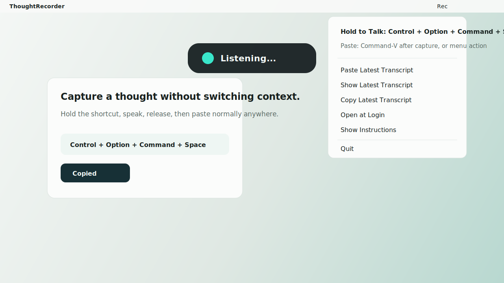

# ThoughtRecorder

ThoughtRecorder is a tiny macOS menu bar app for fast voice capture.



## Download or Build

ThoughtRecorder is open source so people can choose the path that fits them:

- Non-technical users can download a DMG from the website or GitHub Releases.
- Technical users can inspect the code, clone the repo, and build the app locally.

See [INSTALL.md](INSTALL.md) for both install paths.

For privacy details, see [PRIVACY.md](PRIVACY.md).

## Current Status

ThoughtRecorder is currently a community-distributed macOS app. Public release builds are open source and ad-hoc signed unless a release explicitly says it is Developer ID signed and notarized.

Its Phase 1 workflow is intentionally simple:

1. Hold the record shortcut and talk
2. Release to finalize the transcript
3. The transcript is automatically copied to the clipboard
4. Press normal `Command + V` anywhere

That design is deliberate. ThoughtRecorder is a voice buffer, not a universal auto-insert system. It optimizes for repeatable speed instead: record, auto-copy, then paste wherever you want.

## Default Shortcuts

- Hold to talk: `Control + Option + Command + Space`
- Paste captured text: normal `Command + V`

You can change them in [HotKeyManager.swift](HotKeyManager.swift).

## Product Model

ThoughtRecorder keeps a single `latestTranscript` buffer.

- Record shortcut starts and stops speech capture
- Releasing the record shortcut finalizes the transcript and automatically copies it to the clipboard
- The menu can still try to paste or copy the latest transcript
- If direct paste cannot be confirmed, the transcript is kept on the clipboard instead
- Empty capture and canceled capture do not overwrite the latest transcript

This keeps the mental model simple:

- one shortcut means record and copy
- normal `Command + V` pastes the captured text
- menu paste is only a convenience

## Status Overlay

The app shows a tiny non-activating overlay for:

- `Listening...`
- `Processing...`
- `Copied`
- `Pasted`
- `Nothing to paste`
- `No new speech detected - latest unchanged`
- `Canceled`
- `Permission needed`
- short error text

## Menu Bar

The menu bar app exposes:

- shortcut reminders
- `Paste Latest Transcript`
- `Copy Latest Transcript`
- `Clear Latest Transcript`
- `Open at Login`
- `Show Instructions`
- `Quit`

## Build

```bash
chmod +x build.sh
./build.sh
open build/ThoughtRecorder.app
```

## Package for Website Distribution

```bash
chmod +x build.sh scripts/package_dmg.sh scripts/checksum.sh
./scripts/package_dmg.sh
./scripts/checksum.sh
```

The distributable DMG is written to `dist/ThoughtRecorder-1.0.0.dmg`.

Before public distribution, sign/notarize with an Apple Developer ID certificate for the cleanest install experience. See [RELEASE.md](RELEASE.md) for the full release workflow.

## Automation

GitHub Actions builds the app and uploads DMG/checksum artifacts for pushes and pull requests. Tagged releases such as `v1.0.1` publish the DMG assets to GitHub Releases automatically.

## Permissions

macOS will ask for:

- Microphone
- Speech Recognition
- Accessibility

Accessibility is required for the optional menu paste action and Escape-to-cancel support.
The main record-copy-then-`Command + V` workflow works without Accessibility permission.

## Paste Strategy

The primary Phase 1 flow is auto-copy on release.

The optional menu paste action uses a simple best-effort paste path:

1. capture the currently focused field if Accessibility metadata is available
2. place `latestTranscript` on the clipboard
3. send a normal `Cmd+V`
4. restore the previous clipboard when paste can be reasonably verified
5. otherwise keep the transcript on the clipboard and show `Copied`

This means the transcript is still available even when direct paste cannot be trusted.

## Debug Mode

Set:

```bash
THOUGHT_RECORDER_DEBUG=1
```

before launching the app to print:

- shortcut events
- state transitions
- transcript lifecycle milestones
- clipboard copy on successful capture
- paste attempts and fallbacks

This is useful for diagnosing “why didn’t the next transcription start?” problems.

## Known macOS Constraints

- Some apps expose poor Accessibility metadata, so paste verification is imperfect.
- Some secure or custom fields may ignore synthetic paste events.
- The app keeps `latestTranscript` in memory even when paste fails so you can retry immediately.
- The app also keeps a small in-memory recent history of successful captures for debugging only.

## Testing

1. Hold the record shortcut, speak, release, and confirm the overlay says `Copied`.
2. Press normal `Command + V` and confirm the captured text pastes.
3. Optionally use `Paste Latest Transcript` from the menu and confirm it inserts the latest transcript or falls back to `Copied`.
4. Immediately start another recording cycle and confirm it works without getting stuck.
5. Release after silence and confirm `No new speech detected - latest unchanged`.
6. Press `Escape` while recording and confirm the app resets cleanly without replacing the latest transcript.

## Files

- [AppDelegate.swift](AppDelegate.swift): state machine and menu bar orchestration
- [HotKeyManager.swift](HotKeyManager.swift): global record shortcut and cancel handling
- [SpeechController.swift](SpeechController.swift): speech capture lifecycle
- [PasteService.swift](PasteService.swift): clipboard copy and optional paste-latest behavior
- [OverlayWindowController.swift](OverlayWindowController.swift): tiny non-activating status overlay
